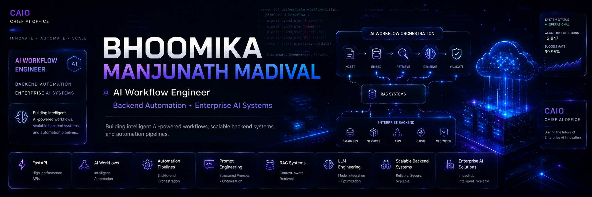

  

<h1 align="center">Hi 👋, I'm Bhoomika</h1>

  

<h3 align="center">
AI Workflow Engineer • Backend Automation • Enterprise AI Systems
</h3>

Building AI-powered backend systems, intelligent automation workflows, and scalable processing pipelines.

---

## 🚀 About Me

- 💼 Junior Engineer Intern at Mindsprint (CAIO Team)
- 🤖 Building AI-assisted backend workflows and automation systems
- ⚙️ Working with FastAPI, workflow orchestration, and scalable processing pipelines
- 🧠 Exploring RAG systems, prompt engineering, and enterprise AI solutions
- 📊 Interested in intelligent automation, backend architecture, and system design
- 🚀 Passionate about solving real-world engineering problems through practical implementation

---

## 💼 Internship Experience

### Mindsprint — CAIO Team

Worked on backend development, AI-assisted workflows, automation systems, and scalable processing pipelines in an enterprise engineering environment.

### Key Areas

- Backend API workflows
- Prompt engineering
- Workflow automation
- Financial PPT generation systems
- Video processing pipelines
- AI-assisted document workflows
- RAG & LLM exposure
- Workflow scalability & optimization

---

## 🛠️ Tech Stack

  

---

## 📌 Featured Projects

### 🎓 SmartLecture AI
AI-powered multilingual lecture processing platform that converts lecture videos into transcripts, summaries, notes, and presentation-ready PowerPoint slides automatically.

### 📊 Financial PPT Automation
Automated backend workflow that transforms financial Excel data and custom inputs into AI-generated business presentation slides.

### 🔄 PPT to HTML Converter
Dynamic PowerPoint-to-web conversion workflow designed for scalable presentation accessibility and automation.

---

## 📈 GitHub Stats

  

  

  

---

## 🐍 Contribution Snake

  

---

## 🌐 Connect With Me

  

  

